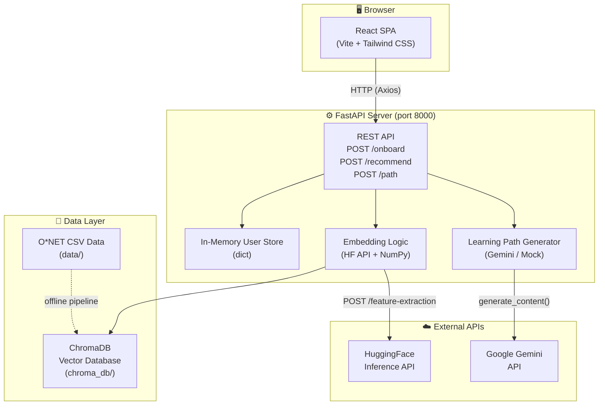
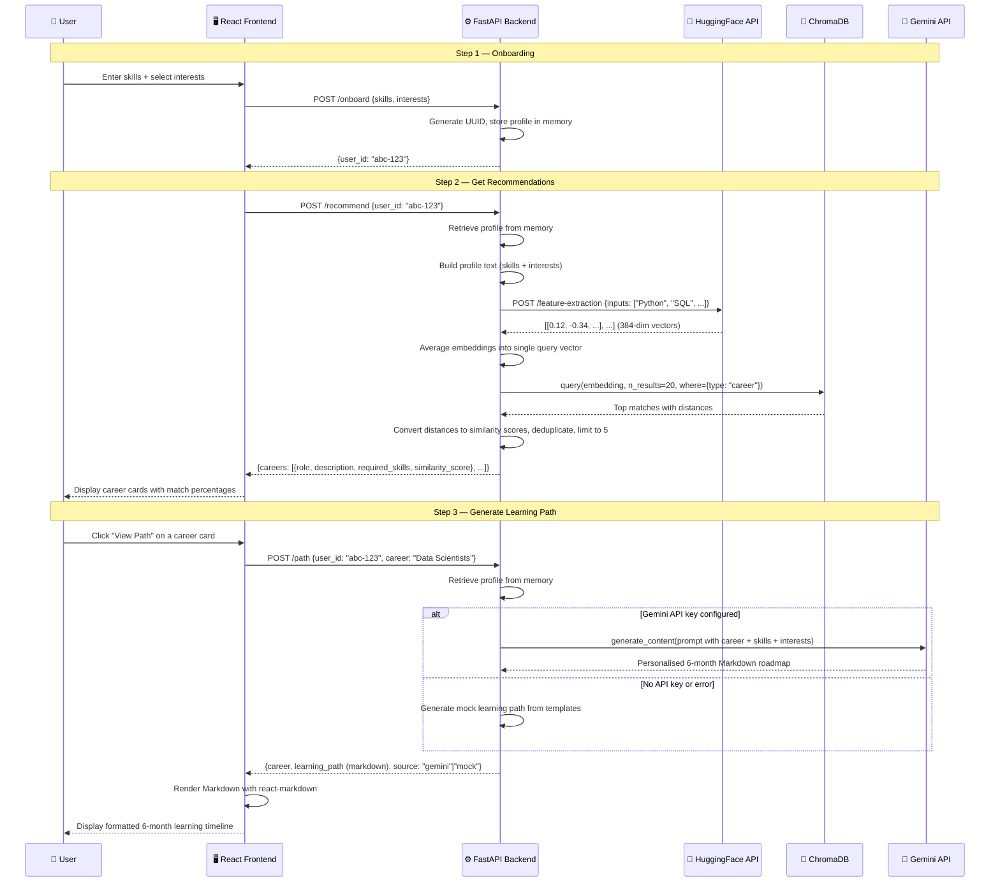
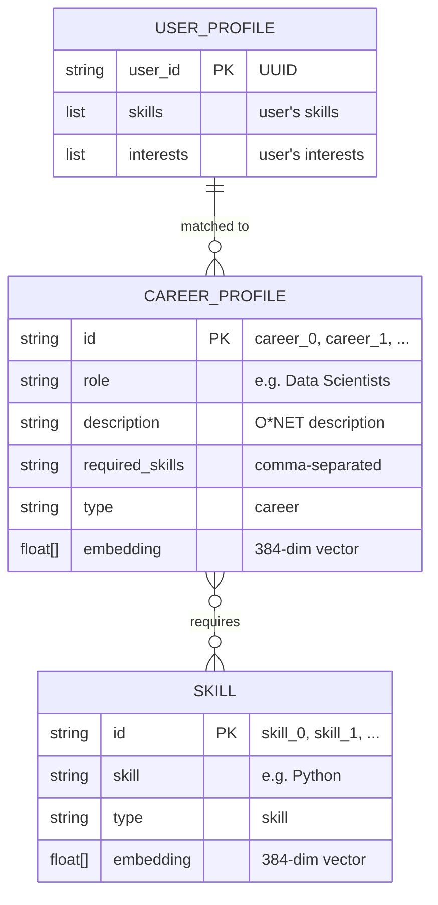
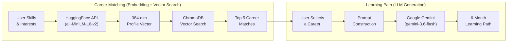
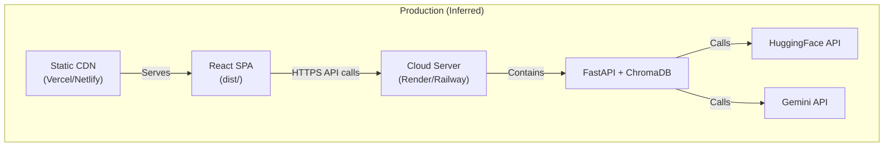

# Career PathFinder — Complete Project Documentation

---

# 1. Project Overview

| Field | Detail |
|---|---|
| **Project Name** | Career PathFinder |
| **One-Line Description** | An AI-powered career guidance web application that matches users to careers based on their skills and interests, and generates personalised 6-month learning roadmaps. |
| **Current Status** | Functional prototype / working application (MVP-complete) |

## Detailed Description

Career PathFinder is a full-stack web application that helps users discover career paths suited to their existing skills and interests. Users enter their skills (e.g. "Python", "SQL", "Communication") and select interest areas (e.g. "Data Science", "Cybersecurity"). The system uses **semantic vector search** (sentence-transformer embeddings stored in ChromaDB) to match the user's profile against over **1,000 real-world occupations** sourced from the U.S. Department of Labor's **O\*NET** database. For each recommended career, the application can then generate a **personalised 6-month learning path** — either via **Google Gemini AI** or via a built-in template engine as a fallback.

## Project Purpose

Bridge the gap between "I have these skills" and "here is a concrete plan to reach that career" — offering intelligent, data-driven career guidance that is typically only available through expensive career counsellors.

## Problem Being Solved

Most people struggle to identify which careers align with their existing skill set. Even when they identify a target career, they lack a structured plan to get there. Career PathFinder solves both problems in one workflow.

## Target Users

- Students choosing career paths
- Working professionals considering a career pivot
- Job seekers who want data-driven recommendations
- Career counsellors looking for a tool to support their clients

## Main Use Cases

1. **Skill-to-career matching** — "Given my skills, what careers suit me?"
2. **Career exploration** — "What skills does a Data Scientist need?"
3. **Learning roadmap generation** — "Give me a 6-month plan to become a Web Developer."

## Key Features (Summary)

- Skill and interest onboarding form
- AI-powered career recommendations using vector similarity
- Personalised 6-month learning paths (Gemini AI or built-in templates)
- Real-world occupation data from O\*NET (1,017 occupations, 8,920 skills)
- Modern React + Vite frontend with Tailwind CSS
- FastAPI REST backend
- ChromaDB vector database

> **"If I had to explain this project to someone in 30 seconds..."**
>
> "Career PathFinder is a web app where you enter your skills and interests, and it uses AI embeddings to recommend real careers from the U.S. O\*NET database. Once you pick a career, it generates a personalised 6-month learning roadmap using Google Gemini AI — complete with courses, projects, and milestones."

---

# 2. Problem Statement

## The Problem

Choosing a career or planning a career transition is overwhelming. There are thousands of possible occupations, each requiring a different mix of skills. Most people have no systematic way to:

1. **Discover** which careers match their current skill set.
2. **Understand** what additional skills they need.
3. **Plan** a concrete learning path to get from where they are to where they want to be.

## Why the Problem Matters

- Poor career decisions lead to job dissatisfaction and high turnover.
- Career counselling is expensive and not accessible to everyone.
- Generic career advice (e.g. "learn to code") is not personalised.
- The sheer volume of available careers (1,000+) makes manual research impractical.

## Limitations of Existing / Manual Approaches

| Approach | Limitation |
|---|---|
| Career counsellors | Expensive, limited availability |
| Job boards | Show openings, not career *fit* |
| Online quizzes | Superficial, not data-driven |
| Self-research | Time-consuming, overwhelming |
| Generic courses | Not personalised to current skills |

## Who Is Affected

Students, mid-career professionals, job seekers, and anyone considering a career change.

---

# 3. Proposed Solution

Career PathFinder solves the problem through a **three-step AI-powered workflow**:

### Step 1 — Know Yourself (Onboarding)
The user enters their current skills and selects interest areas from a curated list.

### Step 2 — Explore Options (Recommendations)
The system computes a semantic embedding of the user's profile, then performs a **vector similarity search** against a database of 1,017 real-world career profiles (from O\*NET). The top 5 most similar careers are returned with match-percentage scores.

### Step 3 — Make It Real (Learning Path)
When the user selects a career, the system generates a **personalised 6-month learning roadmap**. If a Gemini API key is configured, Google Gemini generates a bespoke plan. Otherwise, a rich built-in template engine provides a detailed fallback roadmap.

### Core Improvements Over Traditional Approaches

- **Semantic matching** instead of keyword matching — understands the *meaning* of skills
- **Real government data** (O\*NET) instead of crowd-sourced or synthetic data
- **Personalised plans** that reference the user's existing skills, not generic curricula
- **Instant, free, and accessible** — no appointments or fees

---

# 4. Project Objectives

| # | Objective | Description |
|---|---|---|
| 1 | **Accurate career matching** | Use NLP embeddings to semantically match user skills to real occupations |
| 2 | **Actionable learning paths** | Generate month-by-month roadmaps with real courses, projects, and milestones |
| 3 | **Real-world data** | Ground all recommendations in O\*NET, a trusted government labour-market database |
| 4 | **Modern, intuitive UI** | Provide a clean, step-by-step interface that guides users through the workflow |
| 5 | **AI augmentation** | Leverage Google Gemini for richer, more personalised learning plans |
| 6 | **Graceful degradation** | Work without an AI API key by falling back to high-quality template-based paths |

---

# 5. Key Features

| Feature | What It Does | How It Works | Technology |
|---|---|---|---|
| **Skill Input** | Lets users type skills (comma-separated or one at a time) | React controlled input with tag chips; Enter key or Add button | React, useState |
| **Interest Selection** | Users pick from 8 curated interest categories | Toggle-button grid with visual highlighting | React |
| **Onboarding API** | Saves user profile (skills + interests) and returns a user ID | POST `/onboard` creates an in-memory user record | FastAPI, Pydantic, UUID |
| **Vector-Based Career Matching** | Matches user profile to careers using semantic similarity | Embeds user skills/interests via HuggingFace API, queries ChromaDB for nearest career vectors | Sentence-Transformers (all-MiniLM-L6-v2), ChromaDB, HuggingFace Inference API |
| **Similarity Scoring** | Shows match percentage for each career | Converts Euclidean distance to a 0–100% similarity score | NumPy |
| **Career Cards UI** | Displays top 5 career matches as interactive cards | React card grid with role name, description, key skills, match %, and "View Path" button | React, Tailwind CSS |
| **AI Learning Path Generation** | Generates a personalised 6-month roadmap using Gemini | Constructs a detailed prompt with the user's skills, interests, and target career; sends to Gemini API | Google Gemini (google-genai SDK) |
| **Template Learning Paths** | Fallback learning paths for when Gemini is unavailable | Hard-coded month-by-month plans for 5 popular careers, plus a generic template engine | Python string formatting |
| **Markdown Rendering** | Displays learning paths as beautifully formatted content | react-markdown renders the Gemini/template output with custom-styled components | react-markdown |
| **Data Pipeline** | Transforms raw O\*NET data into clean, indexed career profiles | Python script reads 4 O\*NET CSVs, filters by importance, builds careers/skills/courses CSVs | pandas |
| **Embedding Pipeline** | Builds the ChromaDB vector index from processed data | Encodes career profiles and skills using SentenceTransformer, stores in ChromaDB | sentence-transformers, ChromaDB |
| **Health Check** | Backend readiness probe | GET/HEAD `/health` returns `{"status": "ok"}` | FastAPI |

---

# 6. Technology Stack

| Category | Technology | Version | Purpose | Where Used |
|---|---|---|---|---|
| **Frontend Framework** | React | 19.2.8 | UI component library | `frontend/src/` |
| **Build Tool** | Vite | 8.2.0 | Development server, bundling, HMR | `frontend/vite.config.js` |
| **CSS Framework** | Tailwind CSS | 4.3.3 | Utility-first styling | `frontend/src/index.css`, all JSX components |
| **Routing** | React Router DOM | 7.18.2 | Client-side routing | `frontend/src/App.jsx` |
| **HTTP Client** | Axios | 1.19.0 | API calls from frontend to backend | `frontend/src/api.js` |
| **Markdown Renderer** | react-markdown | 10.1.0 | Renders learning-path markdown as styled HTML | `frontend/src/components/PathView.jsx` |
| **Backend Framework** | FastAPI | 0.141.1 | REST API server | `backend/main.py` |
| **Data Validation** | Pydantic | 2.13.4 | Request/response schema validation | `backend/main.py` |
| **ASGI Server** | Uvicorn | 0.52.3 | Runs the FastAPI application | Runtime |
| **Vector Database** | ChromaDB | 1.5.9 | Stores and queries career/skill embeddings | `backend/main.py`, `scripts/embedding.py` |
| **Embedding Model** | all-MiniLM-L6-v2 | — | Sentence-level semantic embeddings (384-dim) | `scripts/embedding.py` (local), `backend/main.py` (HF API) |
| **Embedding API** | HuggingFace Inference API | — | Remote embedding computation at runtime | `backend/main.py` |
| **LLM** | Google Gemini (gemini-3.6-flash) | — | AI-generated personalised learning paths | `backend/main.py` |
| **LLM SDK** | google-genai | — | Python client for Gemini API | `backend/main.py` |
| **Data Processing** | pandas | 3.0.5 | CSV loading, filtering, and transformation | `scripts/prepare_data.py`, `scripts/embedding.py` |
| **Numerical Computing** | NumPy | 2.5.2 | Embedding averaging and distance calculations | `backend/main.py` |
| **Environment Management** | python-dotenv | 1.2.2 | Loads `.env` file for API keys | `backend/main.py` |
| **Linting** | OxLint | 1.75.0 | JavaScript/React linting | `frontend/.oxlintrc.json` |
| **Typography** | DM Sans, Space Grotesk | — | Google Fonts for body and heading text | `frontend/src/index.css` |
| **Data Source** | O\*NET (U.S. Dept. of Labor) | — | Real-world occupation and skills data | `data/` directory |
| **HTTP Library** | Requests | 2.34.2 | Calls HuggingFace Inference API | `backend/main.py` |
| **Machine Learning** | scikit-learn | 1.9.0 | Listed in requirements (likely transitive dependency) | `requirements.txt` |

---

# 7. Complete Architecture

## System Architecture Overview

Career PathFinder follows a **three-tier architecture**:

1. **Presentation Layer** — React SPA (Vite + Tailwind CSS)
2. **Application Layer** — FastAPI REST API
3. **Data Layer** — ChromaDB vector database + in-memory user store

### External Services

- **HuggingFace Inference API** — Remote sentence embedding computation
- **Google Gemini API** — LLM-powered learning-path generation



### Architecture Description

1. **Frontend (React SPA)**: A single-page application built with React 19 and Vite 8. Uses React Router for navigation between Landing, Onboarding, Recommendations, and Path views. Communicates with the backend via Axios. In development, Vite's proxy rewrites `/api/*` requests to `http://127.0.0.1:8000/*`.

2. **Backend (FastAPI)**: A Python REST API running on Uvicorn. Handles three main operations: user onboarding, career recommendation, and learning-path generation. Uses Pydantic for request/response validation. Stores user profiles in an in-memory dictionary (no persistent database for user data).

3. **ChromaDB**: A persistent vector database (SQLite-backed) that stores pre-computed embeddings for 1,017 career profiles and 8,920 skills. Created offline by the embedding pipeline.

4. **HuggingFace Inference API**: Called at runtime to compute embeddings for user input (skills + interests). Uses the `sentence-transformers/all-MiniLM-L6-v2` model.

5. **Google Gemini API**: Called when a user requests a learning path. Gemini generates a personalised 6-month roadmap. Falls back to built-in templates if the API key is missing or the call fails.

---

# 8. Folder / File Structure

```text
hcl_round2/
├── .env                          # Environment variables (API keys)
├── .env.example                  # Template for .env
├── .gitignore                    # Git ignore rules
├── requirements.txt              # Python dependencies (pip)
│
├── backend/
│   └── main.py                   # FastAPI app — all routes, models, logic
│
├── data/
│   ├── occupation_data.csv       # O*NET occupations (1,017 roles)
│   ├── essential_skills.csv      # O*NET essential skills (17,881 records)
│   ├── transferable_skills.csv   # O*NET transferable skills (44,701 records)
│   ├── software_skills.csv       # O*NET software/tools (31,822 records)
│   ├── careers.csv               # Processed: role + description + skills
│   ├── skills.csv                # Processed: deduplicated skill list (8,920)
│   └── courses.csv               # Synthetic course catalog (13 entries)
│
├── scripts/
│   ├── prepare_data.py           # ETL: O*NET CSVs → careers.csv, skills.csv, courses.csv
│   └── embedding.py              # Builds ChromaDB index from processed CSVs
│
├── chroma_db/
│   ├── chroma.sqlite3            # ChromaDB persistent storage (~14 MB)
│   └── 44c72a1a-…/              # ChromaDB internal segment data
│
└── frontend/
    ├── index.html                # HTML entry point
    ├── package.json              # Node.js dependencies
    ├── vite.config.js            # Vite configuration (proxy, plugins)
    ├── .oxlintrc.json            # OxLint configuration
    ├── public/
    │   ├── favicon.svg           # App favicon
    │   └── icons.svg             # Icon sprite
    └── src/
        ├── main.jsx              # React entry point
        ├── App.jsx               # Root component, routing, global state
        ├── api.js                # Axios API client (onboard, recommend, getPath)
        ├── index.css             # Global styles, Google Fonts, Tailwind import
        ├── assets/
        │   ├── hero.png          # Landing page hero image
        │   ├── react.svg         # React logo
        │   └── vite.svg          # Vite logo
        └── components/
            ├── Landing.jsx       # Landing/home page with CTA
            ├── Onboarding.jsx    # Skills & interests input form
            ├── Recommendations.jsx  # Career match cards
            └── PathView.jsx      # 6-month learning path viewer
```

### Important Files Explained

| File / Folder | Purpose | Key Details |
|---|---|---|
| `backend/main.py` | **The entire backend** — all routes, logic, models, and AI integration in one file | 432 lines; contains FastAPI app, Pydantic models, embedding logic, Gemini integration, mock learning paths, and ChromaDB queries |
| `scripts/prepare_data.py` | **Data ETL pipeline** — transforms raw O\*NET data | Reads 4 source CSVs, filters by importance threshold (≥3.5), produces `careers.csv`, `skills.csv`, `courses.csv` |
| `scripts/embedding.py` | **Embedding pipeline** — builds the vector index | Uses SentenceTransformer locally, encodes all careers and skills, stores in ChromaDB with batch inserts |
| `frontend/src/api.js` | **API client** — centralised HTTP calls | 3 functions: `onboard()`, `recommend()`, `getPath()` |
| `frontend/src/App.jsx` | **Root React component** — routing and state | Manages `userId`, `careers`, `selectedCareer` state; defines 4 routes |
| `data/` | **All data files** — both raw O\*NET and processed | 7 CSV files totalling ~13 MB; raw files have O\*NET SOC codes |
| `chroma_db/` | **Pre-built vector index** — ready to use | ~14 MB SQLite database; can be rebuilt with `scripts/embedding.py` |

---

# 9. Complete Data Flow

## Primary User Flow: From Skills to Learning Path



### Step-by-Step Explanation

1. **User enters skills**: The user types skills like "Python, SQL, Communication" into the Onboarding form and optionally selects interest areas.

2. **Onboarding request**: The frontend sends a POST to `/onboard` with the skills and interests arrays. The backend generates a UUID, stores the profile in an in-memory dictionary, and returns the `user_id`.

3. **Recommendation request**: The frontend immediately sends a POST to `/recommend` with the `user_id`. The backend retrieves the user's profile.

4. **Embedding computation**: The backend sends all skill/interest strings to the HuggingFace Inference API, which returns a 384-dimensional embedding vector for each string.

5. **Average embedding**: The backend averages all individual embedding vectors into a single query vector that represents the user's overall profile.

6. **Vector search**: The query vector is used to search ChromaDB for the nearest career profile vectors (cosine/Euclidean distance). Up to 20 results are fetched, filtered to only career-type entries.

7. **Deduplication and scoring**: Results are deduplicated by role name, distances are converted to similarity percentages (0–100%), and the top 5 unique careers are returned.

8. **Career cards displayed**: The frontend renders the recommended careers as styled cards showing the role name, description, key skills, and match percentage.

9. **Learning path request**: When the user clicks "View Path" on a career card, the frontend sends a POST to `/path` with the `user_id` and career name.

10. **Path generation**: If a Gemini API key is configured, the backend constructs a detailed prompt and calls the Gemini API for a personalised roadmap. Otherwise, it falls back to a template-based path generator.

11. **Markdown rendering**: The learning path (returned as Markdown text) is rendered by `react-markdown` with custom-styled components (headings, lists, horizontal rules, bold text).

---

# 10. Frontend Architecture

## Framework & Build

- **Framework**: React 19.2.8
- **Build tool**: Vite 8.2.0 with `@vitejs/plugin-react`
- **CSS**: Tailwind CSS 4.3.3 (via `@tailwindcss/vite` plugin)
- **Entry point**: `frontend/index.html` → `frontend/src/main.jsx`

## Pages & Routing

| Route | Component | Purpose |
|---|---|---|
| `/` | `Landing.jsx` | Hero section with project tagline and CTA |
| `/onboard` | `Onboarding.jsx` | Skills input form + interest selection |
| `/recommendations` | `Recommendations.jsx` | Career match cards (top 5) |
| `/path` | `PathView.jsx` | 6-month learning path viewer |

## State Management

State is managed via React `useState` hooks in `App.jsx` (lifted state):

| State Variable | Type | Purpose |
|---|---|---|
| `userId` | `string` | Stores the UUID returned by `/onboard` |
| `careers` | `array` | Stores the career matches from `/recommend` |
| `selectedCareer` | `object` | The career the user clicked "View Path" on |

There is no Redux, Zustand, or Context API — the app is small enough for prop drilling.

## API Communication

The `api.js` module creates an Axios instance with:
- **Base URL**: `VITE_API_URL` environment variable, or `/api` (proxied by Vite in dev)
- Three exported functions: `onboard(skills, interests)`, `recommend(userId)`, `getPath(userId, career)`

## Component Details

### Landing.jsx
- Hero section with a large heading: "Your next chapter starts with a direction."
- Tagline badge: "AI-powered career guidance"
- CTA button: "Find my path →" (links to `/onboard`)
- Right-side card showing the 3-step process: Know yourself → Explore options → Make it real

### Onboarding.jsx
- **Skills input**: Text field with "Add" button. Supports Enter key and comma-separated input.
- **Skill chips**: Added skills appear as removable tag pills.
- **Interest grid**: 8 toggle buttons (Data Science, Software Engineering, Business & Management, Product & Design, Healthcare, Finance, Cybersecurity, Marketing).
- **Submit**: Calls `onboard()` then immediately calls `recommend()`, then navigates to `/recommendations`.
- **Error handling**: Displays validation errors (no skills) and API errors in a red alert box.
- **Loading state**: Button text changes to "Analyzing profile…" while waiting.

### Recommendations.jsx
- Displays career cards in a 2-column responsive grid.
- Each card shows: role name, match percentage (green badge), description (4-line clamp), key skills (first 6), and "View Path" button.
- **Empty state**: If no recommendations exist, shows a message with a link back to Onboarding.
- Cards have hover animations (translate-y, shadow enhancement).

### PathView.jsx
- Fetches the learning path via `getPath()` on mount (useEffect).
- Shows a "source" badge: "Generated via Gemini" or "template (demo mode)".
- Uses `react-markdown` with custom component overrides for styled rendering.
- **Loading state**: "Building your learning path…" message.
- **Error state**: Red error box.
- **Back button**: "← Back to recommendations".

## Typography & Design

- **Body font**: DM Sans (Google Fonts)
- **Heading font**: Space Grotesk (Google Fonts)
- **Primary colour**: `#ef7656` (warm coral/orange)
- **Accent colour**: `#2a9d8f` (teal green)
- **Background**: `#f6f7f2` with subtle gradients
- **Dark accents**: `#172033` (near-black navy) for buttons and text

---

# 11. Backend Architecture

## Framework & Entry Point

- **Framework**: FastAPI 0.141.1
- **Server**: Uvicorn 0.52.3
- **Entry point**: `backend/main.py` (single file, 432 lines)
- **Port**: 8000 (default)

## Startup Lifecycle

The backend uses FastAPI's `lifespan` context manager:
1. Loads `.env` from project root
2. Creates a ChromaDB `PersistentClient` pointing to `chroma_db/`
3. Gets or creates the `career_profiles` collection
4. On shutdown, sets the collection reference to `None`

## CORS Configuration

- Reads `CORS_ORIGINS` from environment (defaults to `"*"`)
- Allows all methods, headers, and credentials
- In production, should be set to the deployed frontend URL

## API Endpoints

| Method | Endpoint | Purpose | Request Body | Response |
|---|---|---|---|---|
| `GET`, `HEAD` | `/health` | Health check / readiness probe | — | `{"status": "ok"}` |
| `POST` | `/onboard` | Register user profile | `{"skills": ["Python", "SQL"], "interests": ["Data Science"]}` | `{"user_id": "uuid-string"}` |
| `POST` | `/recommend` | Get career recommendations | `{"user_id": "uuid"}` or `{"skills": [...], "interests": [...]}` | `{"careers": [{role, description, required_skills, similarity_score}, ...]}` |
| `POST` | `/path` | Generate learning path | `{"user_id": "uuid", "career": "Data Scientists"}` | `{"career": "...", "learning_path": "markdown...", "source": "gemini"|"mock"}` |

## Request/Response Models (Pydantic)

| Model | Fields | Purpose |
|---|---|---|
| `OnboardRequest` | `skills: list[str]` (min 1), `interests: list[str]` (optional) | Validate onboard input |
| `OnboardResponse` | `user_id: str` | Return generated UUID |
| `RecommendRequest` | `user_id: Optional[str]`, `skills: Optional[list[str]]`, `interests: Optional[list[str]]` | Flexible: use saved profile or inline skills |
| `CareerMatch` | `role: str`, `description: str`, `required_skills: str`, `similarity_score: float` | Single career recommendation |
| `RecommendResponse` | `careers: list[CareerMatch]` | List of recommendations |
| `PathRequest` | `user_id: str`, `career: str` | Request a learning path |
| `PathResponse` | `career: str`, `learning_path: str`, `source: str` | Return generated path |

## Key Backend Functions

| Function | Purpose |
|---|---|
| `get_hf_embeddings(texts)` | Calls HuggingFace Inference API for sentence embeddings |
| `average_embedding(texts)` | Averages multiple embedding vectors into one |
| `distance_to_similarity(distance)` | Converts Euclidean distance to 0–1 similarity score |
| `resolve_user_profile(payload)` | Resolves skills/interests from user_id or inline payload |
| `build_profile_text(skills, interests)` | Cleans and combines skills + interests into text list |
| `query_career_matches(profile_texts, limit)` | Queries ChromaDB, deduplicates, scores, returns top N |
| `mock_learning_path(career, skills, interests)` | Generates template-based 6-month learning path |
| `generate_learning_path(career, skills, interests)` | Tries Gemini first, falls back to mock |

## Error Handling

- **404**: User not found (invalid `user_id`)
- **400**: Missing skills and user_id in recommend request; empty profile
- **500**: HuggingFace API errors, ChromaDB not loaded
- All errors are raised as `HTTPException` with appropriate status codes and detail messages

---

# 12. Database Architecture

## Technology

**ChromaDB** (version 1.5.9) — an open-source embedding/vector database. Backed by SQLite for persistent storage.

## Storage Location

`chroma_db/chroma.sqlite3` (~14 MB)

## Collection: `career_profiles`

This is the single ChromaDB collection used by the application.

### Document Types

There are two types of documents stored in the same collection, distinguished by a `type` metadata field:

| Type | Count | Document Text | Metadata |
|---|---|---|---|
| `career` | 1,017 | `"{role} {description} {required_skills}"` | `role`, `description`, `required_skills`, `type: "career"` |
| `skill` | 8,920 | `"{skill_name}"` | `skill`, `type: "skill"` |

### How the Database Is Used

1. **At startup**: The backend opens the ChromaDB persistent client and gets the `career_profiles` collection.
2. **At query time**: The `/recommend` endpoint computes a query embedding from the user's profile and calls `collection.query()` with a `where={"type": "career"}` filter to only search career vectors.
3. **Distances**: ChromaDB returns distances (Euclidean by default); these are converted to similarity scores.

### Entity Relationships



> **Note**: `USER_PROFILE` is stored **in-memory** only (a Python dictionary). There is no persistent user database.

---

# 13. AI / Machine Learning Architecture

## Overview

Career PathFinder uses AI/ML in two distinct ways:

1. **Semantic Embedding + Vector Search** — for career matching
2. **Large Language Model (Gemini)** — for learning-path generation

---

### Component 1: Sentence Embeddings for Career Matching

#### What Is It?
A sentence-transformer model (`all-MiniLM-L6-v2`) that converts text into 384-dimensional numerical vectors. Texts with similar meaning produce vectors that are close together in vector space.

#### Why Is It Used?
Traditional keyword matching would miss semantic relationships. For example, "machine learning" and "deep learning" are very different keyword strings but semantically similar. Embeddings capture this meaning, enabling much better matching.

#### How Does It Work Here?

**Offline (Index Building — `scripts/embedding.py`):**
1. Each career profile is converted to a text string: `"{role} {description} {required_skills}"`
2. The local SentenceTransformer model encodes all 1,017 career texts into 384-dim vectors
3. All 8,920 skills are also encoded
4. Vectors + metadata are stored in ChromaDB in batches of 256

**Online (Runtime — `backend/main.py`):**
1. The user's skills and interests are sent to the HuggingFace Inference API (same model, hosted remotely)
2. Individual embedding vectors are averaged into a single profile vector
3. This vector is used to query ChromaDB for the nearest career vectors

#### Input
- **Offline**: Career profile strings, skill names
- **Online**: User skill/interest strings (e.g., `["Python", "SQL", "Data Science"]`)

#### Processing
- Text → 384-dim float vector via `all-MiniLM-L6-v2`
- Multiple vectors averaged element-wise via NumPy
- ChromaDB nearest-neighbour search (Euclidean distance)

#### Output
- **Offline**: Pre-computed vectors stored in ChromaDB
- **Online**: Top 5 career matches with similarity scores (0–100%)

#### Model Details

| Property | Value |
|---|---|
| Model name | `all-MiniLM-L6-v2` |
| Source | Sentence-Transformers (Hugging Face) |
| Embedding dimension | 384 |
| Architecture | MiniLM (lightweight BERT variant) |
| Offline usage | Local `SentenceTransformer` class |
| Online usage | HuggingFace Inference API (`/feature-extraction`) |

---

### Component 2: Google Gemini for Learning-Path Generation

#### What Is It?
Google's Gemini large language model, used as a generative AI to create personalised learning roadmaps.

#### Why Is It Used?
A pre-written template can only cover a limited number of careers. Gemini can generate a unique, contextualised 6-month plan for *any* career, referencing the user's specific skills and interests.

#### How Does It Work Here?

1. A detailed prompt is constructed:
   - Target career name
   - User's current skills
   - User's interests
   - Instructions: month-by-month breakdown, real course platforms, projects, milestones, soft skills, portfolio activities
2. The prompt is sent to `gemini-3.6-flash` via the `google-genai` SDK
3. The response (Markdown text) is returned to the frontend

#### Input
- Career name (string)
- User skills (list of strings)
- User interests (list of strings)

#### Processing
- Prompt engineering → Gemini API call → Markdown text extraction

#### Output
- A personalised 6-month learning path in Markdown format

#### Fallback Mechanism
If the Gemini API key is missing, set to placeholder, or the SDK import fails, the system falls back to `mock_learning_path()`. This function provides detailed, hand-crafted 6-month plans for 5 specific careers (Business Intelligence Analysts, Data Scientists, Web Developers, Graphic Designers, Natural Sciences Managers) and a generic template for any other career.

---

# 14. AI / LLM / RAG Flow

> **Note**: This project does **not** implement a full RAG (Retrieval-Augmented Generation) pipeline. It uses vector search and LLM generation as **separate, sequential steps** rather than feeding retrieved documents into the LLM prompt.

### Actual AI Pipeline



### Stage-by-Stage Explanation

1. **User Input**: Skills like "Python, SQL, Data Analysis" and interests like "Data Science"
2. **Embedding**: Each skill/interest string is converted to a 384-dim vector via the HuggingFace Inference API
3. **Averaging**: All vectors are averaged into a single "profile vector" using NumPy
4. **Vector Search**: ChromaDB finds the 5 career profiles whose embeddings are closest to the profile vector
5. **Scoring**: Euclidean distances are converted to percentage scores: `similarity = max(0, 1 - distance²/2)`
6. **User Choice**: The user reviews the recommendations and selects one
7. **Prompt Construction**: A detailed prompt is built with the career name, user skills, and user interests
8. **LLM Generation**: Gemini generates a personalised 6-month roadmap
9. **Rendering**: The Markdown roadmap is rendered in the frontend

---

# 15. API Integrations / External Services

## 1. HuggingFace Inference API

| Property | Detail |
|---|---|
| **Service** | HuggingFace Inference API |
| **Purpose** | Compute sentence embeddings at runtime |
| **API Endpoint** | `https://api-inference.huggingface.co/pipeline/feature-extraction/sentence-transformers/all-MiniLM-L6-v2` |
| **Method** | POST |
| **Data Sent** | `{"inputs": ["Python", "SQL", ...], "options": {"wait_for_model": true}}` |
| **Data Received** | Array of 384-dimensional float vectors |
| **Authentication** | Bearer token (`HUGGINGFACE_API_KEY`) |
| **Called From** | `backend/main.py` → `get_hf_embeddings()` |
| **Why Needed** | Avoids requiring the full SentenceTransformer model installed on the server at runtime |

## 2. Google Gemini API

| Property | Detail |
|---|---|
| **Service** | Google Gemini (Google AI Studio) |
| **Purpose** | Generate personalised learning paths using AI |
| **Model** | `gemini-3.6-flash` (configurable via `GEMINI_MODEL` env var) |
| **SDK** | `google-genai` Python package |
| **Data Sent** | A structured prompt containing career name, user skills, user interests, and formatting instructions |
| **Data Received** | Markdown-formatted 6-month learning roadmap |
| **Authentication** | API key (`GEMINI_API_KEY`) |
| **Called From** | `backend/main.py` → `generate_learning_path()` |
| **Why Needed** | Enables dynamic, personalised content that would be impossible with static templates |

---

# 16. Authentication & Authorization

> **Not implemented.**
>
> Career PathFinder does **not** have user authentication. There is no login, registration, password system, JWT, OAuth, session management, or role-based access control.
>
> The `user_id` (UUID) generated during onboarding is an **anonymous session identifier**, not an authenticated user identity. User data is stored only in-memory and lost on server restart.

---

# 17. Security

### Implemented Security Mechanisms

| Mechanism | Status | Details |
|---|---|---|
| **CORS middleware** | ✅ Implemented | Configurable origins via `CORS_ORIGINS` env var; defaults to `*` (open) |
| **Pydantic validation** | ✅ Implemented | All API inputs validated with type checking and constraints (e.g., `min_length=1` on skills) |
| **Environment variables** | ✅ Implemented | API keys loaded from `.env` file, not hard-coded |
| **`.gitignore` for `.env`** | ✅ Implemented | `.env` file excluded from version control |
| **API key validation** | ✅ Implemented | Checks if HuggingFace key is set before making API calls |
| **Timeout on external calls** | ✅ Implemented | 30-second timeout on HuggingFace API requests |
| **Graceful error handling** | ✅ Implemented | Gemini failures caught and fall back to mock paths |

### Security Concerns / Areas for Improvement

| Concern | Details |
|---|---|
| **No authentication** | Anyone can access the API; no rate limiting on endpoints |
| **In-memory user store** | User profiles are lost on restart; no data persistence |
| **CORS defaults to `*`** | All origins allowed by default; should be restricted in production |
| **No rate limiting** | HuggingFace/Gemini API calls are not rate-limited per user |
| **No HTTPS enforcement** | No SSL/TLS configuration in the application itself |
| **No input sanitisation beyond Pydantic** | While Pydantic validates types, there's no additional sanitisation for injection attacks |

---

# 18. Configuration & Environment Variables

### `.env` File

```text
GEMINI_API_KEY=<your-gemini-api-key>
HUGGINGFACE_API_KEY=<your-huggingface-api-key>
```

### Environment Variable Reference

| Variable | Required | Default | Purpose |
|---|---|---|---|
| `GEMINI_API_KEY` | Optional | `""` | Google Gemini API key for AI learning paths. If missing, the system uses template-based paths. |
| `GEMINI_MODEL` | Optional | `gemini-3.6-flash` | Override the Gemini model name |
| `HUGGINGFACE_API_KEY` | **Yes** | `""` | HuggingFace Inference API key for embedding computation. Required for career recommendations to work. |
| `CORS_ORIGINS` | Optional | `*` | Comma-separated allowed CORS origins. Set to frontend URL in production. |
| `VITE_API_URL` | Optional (frontend) | `/api` | Backend API URL for the frontend in production. In dev, Vite proxy handles routing. |

> ⚠️ **IMPORTANT**: Never commit actual API keys to version control. The `.env` file is listed in `.gitignore`.

---

# 19. Installation & Setup

### Prerequisites

- **Python** 3.10+ (for the backend)
- **Node.js** 18+ and **npm** (for the frontend)
- **Git** (to clone the repository)
- A **HuggingFace** account with an Inference API key (free tier available)
- (Optional) A **Google AI Studio** account for Gemini API key

### Step-by-Step Setup

#### 1. Clone the Repository
```bash
git clone <repository-url>
cd hcl_round2
```

#### 2. Set Up Environment Variables
```bash
cp .env.example .env
# Edit .env and add your API keys:
#   GEMINI_API_KEY=your_gemini_api_key_here
#   HUGGINGFACE_API_KEY=your_huggingface_api_key_here
```

#### 3. Install Python Dependencies
```bash
pip install -r requirements.txt
```

#### 4. (Optional) Rebuild the Data & Vector Index
The pre-built ChromaDB index is included. To rebuild from scratch:
```bash
# Step 1: Process raw O*NET data
python scripts/prepare_data.py

# Step 2: Build embeddings and populate ChromaDB
python scripts/embedding.py
```
> Note: `scripts/embedding.py` requires the `sentence-transformers` package and downloads the model locally (~90 MB).

#### 5. Start the Backend
```bash
uvicorn backend.main:app --reload --host 127.0.0.1 --port 8000
```

#### 6. Install Frontend Dependencies
```bash
cd frontend
npm install
```

#### 7. Start the Frontend
```bash
npm run dev
```

#### 8. Open the Application
Navigate to `http://localhost:5173` in your browser.

---

# 20. Running the Project

### Startup Sequence

| Order | Service | Port | URL | Command |
|---|---|---|---|---|
| 1 | FastAPI Backend | 8000 | `http://127.0.0.1:8000` | `uvicorn backend.main:app --reload` |
| 2 | Vite Dev Server | 5173 | `http://localhost:5173` | `npm run dev` (from `frontend/`) |

### What Happens at Startup

1. **Backend startup**:
   - Loads `.env` file (API keys)
   - Opens ChromaDB persistent client at `chroma_db/`
   - Creates/gets the `career_profiles` collection
   - Prints a warning if `HUGGINGFACE_API_KEY` is not set
   - FastAPI app is ready to accept requests

2. **Frontend startup**:
   - Vite starts the dev server with HMR
   - Configures a proxy: `/api/*` → `http://127.0.0.1:8000/*`
   - Serves the React app at `http://localhost:5173`

### Important Runtime Details

- **No persistent user database**: User profiles are stored in-memory; they are lost when the backend restarts.
- **ChromaDB is read-only at runtime**: The vector index is pre-built; the backend only queries it.
- **HuggingFace API calls are synchronous**: Each recommendation request blocks while waiting for the embedding API response (up to 30 seconds timeout).

---

# 21. Deployment Architecture

> **No explicit deployment configuration was found in the codebase.** There are no Dockerfiles, CI/CD pipelines, Procfiles, or cloud deployment scripts.

### Inferred Deployment Approach

Based on the code structure and comments:

| Component | Likely Deployment | Evidence |
|---|---|---|
| Frontend | Static hosting (Vercel, Netlify, or similar) | Vite `build` script produces a `dist/` folder; `VITE_API_URL` env var for production API URL |
| Backend | Cloud platform (Render, Railway, or similar) | Comment in `api.js` mentions `https://career-pathfinder-api.onrender.com` as example |
| ChromaDB | Co-located with backend | Uses local filesystem path (`chroma_db/`) |

### Deployment Diagram (Inferred)



> **Note**: This deployment architecture is **inferred from code comments**, not confirmed from deployment files.

---

# 22. Important Algorithms / Logic

## 1. Distance-to-Similarity Conversion

| Property | Detail |
|---|---|
| **Name** | `distance_to_similarity()` |
| **Purpose** | Convert ChromaDB's Euclidean distance to a user-friendly similarity percentage |
| **Formula** | `similarity = max(0, 1 - distance² / 2)` |
| **Input** | Euclidean distance (float, ≥ 0) |
| **Output** | Similarity score (float, 0.0 to 1.0) |
| **Why** | ChromaDB returns distances (lower = more similar), but users understand percentages (higher = better match) |

## 2. Average Embedding

| Property | Detail |
|---|---|
| **Name** | `average_embedding()` |
| **Purpose** | Combine multiple skill/interest embeddings into a single profile vector |
| **Method** | Element-wise mean across all embedding vectors |
| **Input** | List of text strings → List of 384-dim vectors |
| **Output** | Single 384-dim vector |
| **Why** | A single query vector is needed for ChromaDB search; averaging captures the overall theme of the user's profile |

## 3. Importance-Based Skill Filtering

| Property | Detail |
|---|---|
| **Name** | `important_skills()` in `prepare_data.py` |
| **Purpose** | Filter O\*NET skills to only include those with importance ≥ 3.5 |
| **Input** | O\*NET skill records with Scale Name = "Importance" and Data Value |
| **Output** | List of skill names that meet the threshold |
| **Why** | O\*NET includes many marginally relevant skills; the threshold ensures only truly important skills are associated with each career |

## 4. Career Deduplication

| Property | Detail |
|---|---|
| **Name** | Deduplication in `query_career_matches()` |
| **Purpose** | Ensure each career role appears only once in results |
| **Method** | Maintains a `seen_roles` set; skips duplicate role names |
| **Why** | ChromaDB may return multiple vectors for the same career (e.g., different skill aspects); users should see unique career recommendations |

---

# 23. Important Code Components

| Component | File | Purpose | Importance |
|---|---|---|---|
| `app` (FastAPI instance) | `backend/main.py` | Main application object | Core — everything depends on this |
| `get_hf_embeddings()` | `backend/main.py` | HuggingFace embedding API call | Critical — powers career matching |
| `query_career_matches()` | `backend/main.py` | ChromaDB vector search + scoring | Critical — core recommendation logic |
| `generate_learning_path()` | `backend/main.py` | Gemini / mock learning path generation | Critical — delivers the key user value |
| `mock_learning_path()` | `backend/main.py` | Template-based fallback paths | Important — ensures the app works without Gemini |
| `Onboarding.jsx` | `frontend/src/components/Onboarding.jsx` | Skills/interests input form | Critical — primary user input point |
| `Recommendations.jsx` | `frontend/src/components/Recommendations.jsx` | Career match display | Critical — shows AI results to user |
| `PathView.jsx` | `frontend/src/components/PathView.jsx` | Learning path viewer | Critical — delivers final user value |
| `api.js` | `frontend/src/api.js` | Centralised HTTP client | Important — all frontend-backend communication |
| `prepare_data.py` | `scripts/prepare_data.py` | O\*NET data ETL pipeline | Important — transforms raw data into usable format |
| `embedding.py` | `scripts/embedding.py` | ChromaDB index builder | Important — creates the vector search index |
| `App.jsx` | `frontend/src/App.jsx` | Root component, routing, state | Important — application structure |

---

# 24. End-to-End User Journey

### A Realistic Complete User Journey

1. **User opens `http://localhost:5173`** — sees the Landing page with "Your next chapter starts with a direction" headline and a 3-step overview card.

2. **User clicks "Find my path →"** — navigates to `/onboard`.

3. **User types "Python, SQL, Data Analysis"** — presses Enter. Three skill chips appear.

4. **User clicks "Data Science" and "Software Engineering"** — two interest buttons highlight in teal.

5. **User clicks "Get Recommendations"** — button text changes to "Analyzing profile…". The frontend calls `POST /onboard` with `{skills: ["Python", "SQL", "Data Analysis"], interests: ["Data Science", "Software Engineering"]}`.

6. **Backend generates UUID** — stores `{skills, interests}` in memory. Returns `{user_id: "a1b2c3..."}`.

7. **Frontend calls `POST /recommend`** — with the user_id.

8. **Backend computes embeddings** — sends `["Python", "SQL", "Data Analysis", "Data Science", "Software Engineering"]` to HuggingFace API. Gets back 5 vectors (384-dim each). Averages them into one vector.

9. **Backend queries ChromaDB** — finds the 20 nearest career vectors, filters to type="career", deduplicates by role name, converts distances to similarity scores, returns top 5.

10. **Frontend renders career cards** — e.g., "Data Scientists (92% match)", "Business Intelligence Analysts (87% match)", etc. User sees descriptions and key skills.

11. **User clicks "View Path" on "Data Scientists"** — navigates to `/path`.

12. **Frontend calls `POST /path`** — with `{user_id: "a1b2c3...", career: "Data Scientists"}`.

13. **Backend generates learning path** — constructs a prompt and calls Gemini API (or falls back to template). Returns Markdown content.

14. **Frontend renders the learning path** — a beautifully formatted 6-month timeline with month-by-month courses, projects, milestones, and tips.

15. **User reads and follows the roadmap** — can navigate back to see other career options.

---

# 25. Example Input → Processing → Output

### Example 1: Career Recommendation

#### Input
```json
{
  "skills": ["Python", "SQL", "Machine Learning"],
  "interests": ["Data Science"]
}
```

#### Processing
1. Skills + interests combined: `["Python", "SQL", "Machine Learning", "Data Science"]`
2. Each string embedded via HuggingFace API → 4 vectors of 384 dimensions
3. Vectors averaged → single 384-dim profile vector
4. ChromaDB queried for nearest career profiles
5. Distances converted to similarity scores
6. Top 5 unique careers returned

#### Output
```json
{
  "careers": [
    {
      "role": "Data Scientists",
      "description": "Develop and implement techniques or analytics applications...",
      "required_skills": "Machine Learning, Python, SQL, TensorFlow, ...",
      "similarity_score": 0.9234
    },
    {
      "role": "Business Intelligence Analysts",
      "description": "Produce financial and market intelligence...",
      "required_skills": "SQL, Data Analysis, Tableau, ...",
      "similarity_score": 0.8712
    }
  ]
}
```

### Example 2: Learning Path Generation

#### Input
```json
{
  "user_id": "a1b2c3-...",
  "career": "Data Scientists"
}
```

#### Processing
1. Retrieve user profile: skills=["Python", "SQL", "Machine Learning"], interests=["Data Science"]
2. Construct Gemini prompt with career, skills, and interests
3. Call Gemini API → receive Markdown roadmap
4. (Or generate mock template if Gemini unavailable)

#### Output (Mock Template Example)
```markdown
## 🧭 6-Month Learning Path: Data Scientists

### Your starting point
- **Current skills:** Python, SQL, Machine Learning
- **Interests:** Data Science
- **Goal:** Transition into a Data Scientists role...

### Month 1 – Foundations
**Focus:** Build the core knowledge required...
- **Courses:** Machine Learning A-Z – Udemy, Python for Data Science – Coursera
- **Projects:** Predict customer churn using logistic regression.

### Month 2 – Applied Practice
...

### Month 6 – Job Transition
...
```

---

# 26. Error Handling

### Backend Error Handling

| Error Scenario | HTTP Code | Detail Message | Handling |
|---|---|---|---|
| User not found (invalid user_id) | 404 | "User not found." | HTTPException raised |
| No skills or user_id provided | 400 | "Provide either user_id or a non-empty skills list." | HTTPException raised |
| Empty profile (whitespace-only skills) | 400 | "Profile must include skills or interests." | HTTPException raised |
| HuggingFace API key missing | 500 | Runtime error | RuntimeError raised |
| HuggingFace API returns non-200 | 500 | Error details from HF response | RuntimeError raised |
| ChromaDB collection not loaded | 500 | "Chroma collection is not loaded." | RuntimeError raised |
| Gemini API failure | — | Falls back to mock path | Exception caught, logged to stdout |
| Gemini returns empty content | — | Falls back to mock path | Checked with `if not content` |

### Frontend Error Handling

| Error Scenario | Handling |
|---|---|
| API call fails during onboarding | Red error box: `err.response?.data?.detail` or generic message |
| Backend not running | "Failed to submit profile. Is the backend running?" |
| No recommendations available | Empty-state message with "Go to Onboarding" link |
| No career selected for path view | Redirect prompt to Recommendations page |
| Path API call fails | Red error box with detail message |

### Logging

- Backend prints `Gemini error: {e}` to stdout on Gemini failures
- Backend prints a warning if `HUGGINGFACE_API_KEY` is not set at startup
- No structured logging framework is implemented

---

# 27. Performance Considerations

### Current Optimizations

| Optimization | Details |
|---|---|
| **Pre-computed embeddings** | Career and skill embeddings are computed offline and stored in ChromaDB; no on-the-fly encoding needed for the database |
| **Over-fetching + filtering** | Queries 4× the desired results (`limit * 4`), then filters and deduplicates client-side for better result quality |
| **Batch embedding inserts** | The embedding pipeline inserts vectors in batches of 256 to avoid memory issues |
| **Lightweight embedding model** | `all-MiniLM-L6-v2` is a small, fast model (~23M parameters) designed for efficient inference |
| **Vite build optimisation** | Vite's production build includes tree-shaking, code splitting, and minification |

### Potential Bottlenecks

| Bottleneck | Impact | Mitigation Suggestion |
|---|---|---|
| **HuggingFace API latency** | Each recommendation requires a remote API call (~1–5 seconds) | Could cache embeddings for common skills, or run the model locally |
| **Synchronous API calls** | FastAPI endpoints use blocking `requests.post()` for HF API | Should use `httpx` with async for better concurrency |
| **In-memory user store** | Memory grows with each user; all data lost on restart | Use a persistent database (PostgreSQL, Redis) |
| **No caching** | Same skill set queried twice hits the HF API twice | Add Redis/in-memory cache for embeddings |
| **Single-file backend** | 432-line `main.py` may become hard to maintain as features grow | Split into modules (routes, services, models) |

---

# 28. Testing

> **No test files were found in the codebase.**
>
> There are no unit tests, integration tests, or end-to-end tests. No testing framework (pytest, Jest, Cypress, etc.) is configured.

### Linting

- **Frontend**: OxLint is configured (`.oxlintrc.json`) with React rules (hooks, export conventions)
- **Backend**: No linting configuration found

---

# 29. Current Limitations

### Confirmed Limitations

| Category | Limitation |
|---|---|
| **Persistence** | User profiles are in-memory only; lost on server restart |
| **Authentication** | No user accounts, login, or session management |
| **Testing** | No automated tests of any kind |
| **Scalability** | In-memory user store doesn't scale; HuggingFace API has rate limits |
| **Data freshness** | O\*NET data is static (requires manual re-indexing for updates) |
| **Course data** | Only 13 synthetic course entries; the courses.csv is a seed catalog |
| **Offline operation** | Requires internet for HuggingFace API (career matching) and Gemini API (learning paths) |
| **Career coverage** | Mock learning paths only cover 5 specific careers; others get a generic template |
| **Backend structure** | Entire backend is a single 432-line file |
| **No mobile optimization** | While responsive, no PWA or native mobile app |
| **CORS** | Defaults to `*` (all origins), insecure for production |

### Reasonable Future Considerations

| Consideration | Details |
|---|---|
| **Cold start latency** | First HuggingFace API call may be slow if the model is not warm |
| **Token costs** | Gemini API calls consume tokens; heavy usage could incur costs |
| **Data accuracy** | O\*NET data may not reflect the very latest job market trends |

---

# 30. Future Improvements

### Short-Term (1–2 Weeks)

- Add persistent user storage (SQLite or PostgreSQL)
- Add user authentication (JWT or session-based)
- Implement response caching for common skills
- Add basic unit tests for backend functions
- Split `main.py` into separate modules (routes, services, models)

### Medium-Term (1–2 Months)

- Run the embedding model locally instead of calling HuggingFace API (faster, no rate limits)
- Add a real course database with verified links and reviews
- Implement a progress tracker where users can mark learning milestones
- Add a skill-gap analysis feature ("You need these skills for Data Scientists: ...")
- Add resume upload + automatic skill extraction (NLP)
- Implement rate limiting and API security

### Long-Term (3–6 Months)

- Build a RAG pipeline: feed actual course/certification data into the Gemini prompt
- Add collaborative filtering: "Users with similar skills also explored..."
- Integrate with job boards (LinkedIn, Indeed) for live job listings
- Build a mobile app (React Native)
- Add employer-side features (talent matching)
- Multi-language support

---

# 31. Project Strengths

| Strength | Details |
|---|---|
| **Real data foundation** | Uses authoritative O\*NET government data (1,017 occupations), not synthetic or crowd-sourced data |
| **Semantic AI matching** | Vector embeddings capture skill *meaning*, not just keywords — superior to traditional job-matching approaches |
| **Graceful fallback** | Works without Gemini API by providing rich template-based learning paths |
| **Clean architecture** | Clear separation between offline data pipeline, backend API, and frontend SPA |
| **Modern tech stack** | React 19, Vite 8, FastAPI, ChromaDB — current, performant technologies |
| **User experience** | Step-by-step guided workflow with polished UI, animations, and responsive design |
| **Actionable output** | Doesn't just recommend careers — provides a concrete 6-month plan with courses, projects, and milestones |
| **Low barrier to entry** | Works with free-tier API keys; no complex infrastructure needed |

---

# 32. Innovation / Uniqueness

| Innovation | Description |
|---|---|
| **Skill-to-career semantic matching** | Most career tools use keyword matching or quizzes; this project uses NLP embeddings for meaning-based matching |
| **Combined vector search + LLM generation** | Uses two different AI techniques for two different parts of the workflow (matching vs. planning) |
| **O\*NET integration** | Grounds recommendations in real labour-market data rather than opinion-based or synthetic career lists |
| **Personalised learning paths** | The LLM-generated roadmap references the user's *specific* skills and interests, not generic advice |
| **Dual-mode AI** | Gemini for premium experience, template engine for reliable fallback — ensures the app always delivers value |

### Where Differentiation Could Improve

- A full RAG pipeline (feeding course data into the LLM) would produce even more specific recommendations
- Skill-gap visualisation (radar charts comparing user skills vs. required skills) would enhance the UX
- Integration with actual learning platforms (API-based course search) would make recommendations directly actionable

---

# 33. Why These Technologies Were Chosen

| Technology | Why This Over Alternatives? |
|---|---|
| **React** | Industry-standard UI library with huge ecosystem; component model ideal for this step-by-step workflow |
| **Vite** | Fastest frontend build tool available; instant HMR; native ESM support; built-in proxy for API development |
| **Tailwind CSS** | Rapid prototyping with utility classes; no context-switching between CSS files and components |
| **FastAPI** | Python-native, async-ready, automatic API docs, Pydantic integration — ideal for ML-backed APIs |
| **ChromaDB** | Purpose-built for embedding storage and retrieval; simpler than Pinecone/Weaviate; works locally without cloud services |
| **all-MiniLM-L6-v2** | Fast, lightweight sentence-transformer (23M params, 384-dim); excellent quality-to-speed ratio; free on HuggingFace |
| **Google Gemini** | Google's latest LLM with competitive pricing; `gemini-3.6-flash` is fast and cost-effective for generation tasks |
| **HuggingFace Inference API** | Avoids installing a full ML runtime on the server; free tier sufficient for development |
| **Pydantic** | Type-safe request/response validation that auto-generates OpenAPI docs with FastAPI |
| **Axios** | Promise-based HTTP client with interceptors, error handling, and instance configuration |
| **react-markdown** | Renders Gemini's Markdown output as React components with custom styling |
| **pandas** | De facto standard for CSV/data manipulation in Python; perfect for the O\*NET ETL pipeline |

---

# 34. Technical Challenges

### 1. Embedding Dimensionality Handling

| Property | Detail |
|---|---|
| **Problem** | HuggingFace API sometimes returns token-level embeddings (3D array) instead of sentence-level (2D array) |
| **Why Difficult** | Different model deployments return different shapes; the code must handle both |
| **Solution** | Check array dimensionality (`arr.ndim == 2`) and mean-pool over the token dimension if needed |
| **Result** | Robust embedding extraction regardless of API response format |

### 2. Career Deduplication in Vector Search

| Property | Detail |
|---|---|
| **Problem** | ChromaDB may return multiple entries for the same career role (different vector aspects) |
| **Why Difficult** | Simply limiting `n_results` could miss good matches; need to over-fetch then deduplicate |
| **Solution** | Fetch 4× the desired limit, then filter by unique role names using a `seen_roles` set |
| **Result** | Users always see unique career recommendations |

### 3. Graceful AI Degradation

| Property | Detail |
|---|---|
| **Problem** | The app must work even without a Gemini API key |
| **Why Difficult** | Learning paths are a core feature; a blank page would be a poor experience |
| **Solution** | Hand-crafted template paths for 5 popular careers + a generic template engine for all others |
| **Result** | The app always delivers a detailed 6-month learning path, regardless of API availability |

### 4. Offline vs. Online Embedding Consistency

> Likely technical consideration.

| Property | Detail |
|---|---|
| **Problem** | Index is built with local SentenceTransformer; queries use HuggingFace Inference API |
| **Why Difficult** | Model versions or quantisation differences could produce slightly different vectors |
| **Solution** | Both use the same model name (`all-MiniLM-L6-v2`); HuggingFace hosts the canonical model |
| **Result** | Vectors are compatible, though minor numerical differences are possible |

---

# 35. Complete System Summary

| Aspect | Summary |
|---|---|
| **Problem** | People struggle to find careers that match their skills and lack structured plans to reach career goals |
| **Solution** | An AI-powered web app that matches skills to careers using vector search, then generates personalised 6-month learning roadmaps |
| **Architecture** | React SPA → FastAPI REST API → ChromaDB (vector search) + HuggingFace (embeddings) + Gemini (LLM generation) |
| **Technologies** | React 19, Vite 8, Tailwind CSS 4, FastAPI, ChromaDB, all-MiniLM-L6-v2, Google Gemini, HuggingFace API |
| **AI/ML** | Sentence embeddings for semantic career matching + LLM for personalised learning-path generation |
| **Data Flow** | User skills → Embeddings → Vector search → Career matches → LLM generation → Personalised roadmap |
| **Data Source** | 1,017 occupations from U.S. O\*NET database; 8,920 deduplicated skills |
| **Main Features** | Skill onboarding, AI career matching, similarity scoring, 6-month learning paths |
| **Deployment** | Local development setup; no production deployment config (inferred: Vercel + Render) |
| **Impact** | Makes AI-powered career guidance accessible, free, and instant — typically a service requiring expensive human counsellors |

---

# 36. PPT / Presentation Ready Information

### Recommended Slide Count: 14

---

### Slide 1 — Title
**Career PathFinder**
*AI-powered career guidance that turns your skills into a roadmap*

---

### Slide 2 — Problem Statement
- Choosing a career is overwhelming (1,000+ occupations exist)
- People don't know which careers match their current skills
- Career counselling is expensive and inaccessible
- Generic career advice is not personalised
- No easy way to create a structured learning plan

---

### Slide 3 — Proposed Solution
- **Enter your skills & interests** → AI understands your profile
- **Get career matches** → Semantic vector search across 1,017 real occupations
- **Receive a 6-month learning roadmap** → Personalised by Google Gemini AI
- Grounded in U.S. Department of Labor (O\*NET) data

---

### Slide 4 — Objectives
1. Match user skills to real-world careers using NLP embeddings
2. Provide actionable, month-by-month learning plans
3. Ground all recommendations in authoritative government data
4. Deliver a modern, intuitive user experience
5. Ensure the app works with or without AI API keys (graceful fallback)

---

### Slide 5 — Key Features
- AI-powered semantic skill-to-career matching
- 1,017 real occupations from O\*NET database
- Similarity scoring with match percentages
- Personalised 6-month learning paths via Google Gemini
- Template fallback for offline/demo use
- Modern React SPA with step-by-step workflow
- Real-time embedding computation via HuggingFace API

---

### Slide 6 — System Architecture
*(Include the Mermaid architecture diagram from Section 7)*
- React SPA (Vite + Tailwind) → FastAPI Backend → ChromaDB Vector DB
- External: HuggingFace Inference API + Google Gemini API
- Offline pipeline: O\*NET CSVs → pandas ETL → SentenceTransformer → ChromaDB

---

### Slide 7 — Technology Stack
| Layer | Technologies |
|---|---|
| Frontend | React 19, Vite 8, Tailwind CSS 4, Axios, react-markdown |
| Backend | FastAPI, Pydantic, Uvicorn, python-dotenv |
| AI/ML | all-MiniLM-L6-v2 (embeddings), Google Gemini (LLM) |
| Database | ChromaDB (vector store), SQLite (backing store) |
| Data | O\*NET (U.S. Dept. of Labor), pandas (ETL) |
| APIs | HuggingFace Inference API, Google Gemini API |

---

### Slide 8 — Workflow / Data Flow
1. User enters skills + interests
2. Backend embeds input via HuggingFace API
3. Vectors averaged into a profile embedding
4. ChromaDB vector search finds matching careers
5. Top 5 careers returned with similarity scores
6. User selects a career
7. Gemini AI generates a personalised 6-month learning path
8. Path rendered as formatted Markdown in the frontend

---

### Slide 9 — AI/ML Architecture
- **Embedding Model**: all-MiniLM-L6-v2 (384-dim sentence embeddings)
- **Vector Database**: ChromaDB with 1,017 career vectors + 8,920 skill vectors
- **Matching Method**: Euclidean distance → similarity percentage
- **LLM**: Google Gemini (gemini-3.6-flash) for learning-path generation
- **Fallback**: Template-based path generator (works without API)

---

### Slide 10 — Data Pipeline
- **Source**: 4 O\*NET CSV files (occupation data, essential skills, transferable skills, software skills)
- **ETL**: Python + pandas → filter by importance threshold (≥3.5) → produce careers.csv (1,017), skills.csv (8,920), courses.csv (13)
- **Indexing**: SentenceTransformer encodes all data → stored in ChromaDB

---

### Slide 11 — Demo / User Journey
1. Landing page → "Find my path" CTA
2. Onboarding → Enter skills (e.g., Python, SQL) + select interests
3. Recommendations → See top 5 career matches with similarity %
4. Learning Path → View personalised 6-month roadmap with courses, projects, milestones

---

### Slide 12 — Innovation
- Semantic AI matching (not keyword-based)
- Dual AI pipeline: embeddings for matching + LLM for generation
- Authoritative government data (O\*NET)
- Graceful degradation (works without AI API keys)
- Personalised, actionable output (not generic advice)

---

### Slide 13 — Challenges & Solutions
| Challenge | Solution |
|---|---|
| Variable embedding API response formats | Automatic dimensionality detection + mean-pooling |
| Duplicate career results | Over-fetch + deduplicate strategy |
| Gemini API unavailability | Rich template fallback for 5+ careers |
| Large dataset indexing | Batch inserts (256 at a time) |

---

### Slide 14 — Future Scope
- Persistent user database + authentication
- Local embedding model (no API dependency)
- Skill-gap analysis and visualisation
- Resume upload + automatic skill extraction
- RAG pipeline for course recommendations
- Mobile app and multi-language support

---

# 37. Presentation Content Pack

## Project One-Liner
Career PathFinder uses AI embeddings and Google Gemini to match your skills to real careers and generate a personalised 6-month learning roadmap.

## Elevator Pitch
Imagine you could type in the skills you have — Python, SQL, communication — and instantly discover the top 5 careers that match your profile, backed by real government labour data from over 1,000 occupations. Then, with one click, get a personalised 6-month plan with courses, projects, and milestones to reach that career. That's Career PathFinder: AI-powered career guidance that's instant, free, and actionable.

## Problem
- 1,000+ career options make choosing overwhelming
- People don't know which careers match their existing skills
- Career counselling is expensive and not accessible to everyone
- Generic advice doesn't account for individual starting points
- No tool combines career discovery AND structured learning plans

## Solution
- Semantic AI embedding matches skills to careers by *meaning*, not keywords
- Real O\*NET data covers 1,017 occupations with verified skill requirements
- Google Gemini generates personalised 6-month learning paths
- Step-by-step UI guides users from profile to roadmap in under 2 minutes
- Works without AI APIs via high-quality template fallback

## Key Features
- AI-powered semantic career matching (all-MiniLM-L6-v2 + ChromaDB)
- 1,017 real-world occupations from O\*NET
- Similarity scoring with match percentages
- Personalised 6-month learning paths (Google Gemini)
- Template-based fallback for reliable demo/offline use
- Modern React 19 + Vite 8 frontend
- FastAPI REST backend with Pydantic validation
- Complete offline data pipeline (ETL + embedding)

## Technology Stack
React 19, Vite 8, Tailwind CSS 4, FastAPI, ChromaDB, all-MiniLM-L6-v2, Google Gemini, HuggingFace Inference API, pandas, NumPy, Pydantic, Axios, react-markdown

## Architecture
Three-tier: React SPA (frontend) → FastAPI REST API (backend) → ChromaDB vector database (data). External services: HuggingFace for embeddings, Gemini for generation.

## Workflow
1. User enters skills and selects interests
2. Backend embeds input via HuggingFace API
3. Embedding vectors averaged into a profile vector
4. ChromaDB vector search finds top career matches
5. Results returned with similarity percentages
6. User selects a career
7. Gemini generates a personalised 6-month learning path
8. Frontend renders the Markdown roadmap

## AI/ML
- **Embeddings**: all-MiniLM-L6-v2 sentence-transformer (384-dim) for semantic skill-to-career matching
- **Vector DB**: ChromaDB stores and queries pre-computed career embeddings
- **LLM**: Google Gemini (gemini-3.6-flash) for personalised learning-path generation
- **Fallback**: Template engine with hand-crafted paths for 5 major careers

## Innovation
- Semantic matching outperforms keyword-based career tools
- Combines two AI paradigms (embedding search + LLM generation) in one workflow
- Anchored in authoritative government data (not opinions or surveys)
- Personalises output to the user's specific starting point
- Dual-mode AI ensures reliability (Gemini + template fallback)

## Impact
- Makes AI career guidance accessible without expensive counsellors
- Covers 1,017 occupations — far more than any human counsellor could know
- Delivers actionable plans (courses, projects, milestones) rather than vague advice
- Works with free-tier API keys — zero cost for users

## Future Scope
- Persistent user accounts and progress tracking
- Local embedding model for faster, API-free matching
- Skill-gap analysis with visual radar charts
- Resume upload with automatic skill extraction (NLP)
- RAG pipeline for course-specific recommendations

## Conclusion
Career PathFinder demonstrates that AI can make personalised career guidance instant, accessible, and actionable. By combining semantic vector search with LLM generation, grounded in real labour-market data, it bridges the gap between "what skills do I have?" and "here is how I get to my dream career."

---

# 38. Viva & Interview Questions

## Beginner Questions

**Q1: What does Career PathFinder do?**
A: It's a web application that takes a user's skills and interests, matches them to real-world careers using AI, and generates a personalised 6-month learning plan to reach that career.

**Q2: What is O\*NET and why is it used?**
A: O\*NET is a database maintained by the U.S. Department of Labor that contains detailed information about over 1,000 occupations, including required skills, descriptions, and tools. It's used because it provides authoritative, real-world career data.

**Q3: What are the main steps in the user journey?**
A: (1) Enter skills and interests, (2) View recommended careers with match percentages, (3) Select a career and get a personalised 6-month learning path.

**Q4: What is a sentence embedding?**
A: It's a numerical representation (a list of numbers, like a 384-dimensional vector) that captures the *meaning* of a sentence or phrase. Similar meanings produce similar vectors.

**Q5: What is ChromaDB?**
A: ChromaDB is an open-source vector database that stores embedding vectors and lets you search for the most similar vectors. It's like a search engine that understands meaning instead of just keywords.

**Q6: What is the frontend built with?**
A: React 19 with Vite 8 as the build tool, Tailwind CSS for styling, and React Router for navigation.

**Q7: What is the backend built with?**
A: FastAPI, a modern Python web framework, running on Uvicorn ASGI server.

**Q8: What happens if the Gemini API key is not configured?**
A: The system falls back to a built-in template engine that generates detailed 6-month learning paths for several popular careers and a generic template for others.

**Q9: How does the frontend communicate with the backend?**
A: Via HTTP requests using Axios. In development, Vite's proxy forwards `/api/*` requests to the FastAPI server on port 8000.

**Q10: What is a similarity score in this context?**
A: It's a percentage (0–100%) that indicates how closely a career's required skills match the user's profile. Higher scores mean a better fit.

## Technical Questions

**Q1: Why is `all-MiniLM-L6-v2` used instead of a larger model?**
A: It offers an excellent quality-to-speed ratio. With only 23M parameters and 384-dim output, it's fast and efficient while still producing high-quality semantic embeddings, making it ideal for both local indexing and API-based inference.

**Q2: How does the distance-to-similarity conversion work?**
A: The formula is `similarity = max(0, 1 - distance²/2)`. This transforms Euclidean distance (where 0 is identical, higher means different) into a similarity score (where 1 is identical, 0 means no match).

**Q3: Why does the system over-fetch from ChromaDB?**
A: It queries for `limit * 4` results (e.g., 20 for a limit of 5) because multiple entries may exist for the same career role. After deduplication by role name, the top `limit` unique careers are returned.

**Q4: How is the user profile stored?**
A: In a Python dictionary (`users: dict[str, dict]`) in memory, keyed by UUID. This means all user data is lost when the server restarts.

**Q5: What is the embedding pipeline and when is it run?**
A: The embedding pipeline (`scripts/embedding.py`) encodes all career profiles and skills using a local SentenceTransformer model and stores the vectors in ChromaDB. It's run once offline (or when the data changes), not at runtime.

**Q6: How does the HuggingFace API call handle variable response formats?**
A: The code checks `arr.ndim`: if the API returns a 2D array (token-level embeddings), it mean-pools over the token dimension to get a single sentence vector. If it returns a 1D vector (already pooled), it uses it directly.

**Q7: Why are two different methods used for embedding (local model vs. API)?**
A: The local SentenceTransformer is used during the offline indexing phase (for speed with large batches). The HuggingFace Inference API is used at runtime to avoid requiring the full model installation on the server.

**Q8: How does the `/recommend` endpoint support both user_id and inline skills?**
A: The `resolve_user_profile()` function first checks for `user_id` (looks up stored profile), then falls back to inline `skills`/`interests` fields. This allows both authenticated and anonymous recommendations.

**Q9: What is the purpose of the `lifespan` context manager?**
A: It manages the ChromaDB client lifecycle. On startup, it creates the persistent client and loads the collection. On shutdown, it cleans up by setting the collection reference to `None`.

**Q10: How does the Vite proxy work?**
A: In `vite.config.js`, the `server.proxy` configuration rewrites any request to `/api/*` by stripping the `/api` prefix and forwarding it to `http://127.0.0.1:8000/*`. This avoids CORS issues during development.

**Q11: What data transformation does `prepare_data.py` perform?**
A: It reads 4 raw O\*NET CSV files, filters skills by importance threshold (≥3.5), combines essential, transferable, and software skills per occupation, and outputs three clean CSVs: `careers.csv`, `skills.csv`, and `courses.csv`.

**Q12: What is the `IMPORTANCE_THRESHOLD` and why is it 3.5?**
A: It's a filter applied to O\*NET skill importance ratings (on a 1–5 scale). Skills rated ≥3.5 are considered important enough to be "required" for a career. This filters out marginally relevant skills.

**Q13: How does the mock learning path differ from the Gemini-generated one?**
A: The mock path uses Python string formatting with hard-coded career-specific content (courses, projects, certifications) for 5 careers, plus a generic template. The Gemini-generated path is dynamically created with each request and fully personalised.

**Q14: Why is FastAPI chosen over Flask or Django?**
A: FastAPI offers automatic OpenAPI documentation, built-in Pydantic validation, async support, and better performance than Flask. Django would be overkill for a simple REST API with no ORM needs.

**Q15: What role does NumPy play in the backend?**
A: NumPy performs the element-wise averaging of multiple embedding vectors into a single profile vector, and handles array dimensionality checks for HuggingFace API response processing.

## Architecture Questions

**Q1: Why is this a separate frontend and backend rather than a monolithic app?**
A: Separation allows independent scaling, deployment, and technology choices. The React SPA can be served from a CDN while the Python backend runs on a different server optimised for ML workloads.

**Q2: Why ChromaDB instead of a traditional database like PostgreSQL?**
A: ChromaDB is purpose-built for vector similarity search. PostgreSQL could do vector search with pgvector, but ChromaDB is simpler to set up and provides built-in embedding storage, metadata filtering, and nearest-neighbour search.

**Q3: What would you change if this needed to handle 10,000 concurrent users?**
A: (1) Move user storage to a persistent database, (2) add Redis for caching embeddings, (3) run the embedding model locally to avoid API rate limits, (4) use async HTTP calls, (5) deploy with horizontal scaling behind a load balancer.

**Q4: Why is the entire backend in a single file?**
A: The application is small enough that a single file keeps everything visible and easy to understand. For production, it should be split into separate modules for routes, services, models, and utilities.

**Q5: How would you add a RAG pipeline to this project?**
A: (1) Build a knowledge base of courses, certifications, and learning resources, (2) when generating a learning path, retrieve relevant resources via vector search, (3) include them in the Gemini prompt as context, (4) Gemini generates a plan that references specific, verified resources.

**Q6: What are the trade-offs of using the HuggingFace API vs. running the model locally?**
A: HuggingFace API: simpler deployment, no GPU needed, but adds network latency and depends on external service availability. Local model: faster, no rate limits, works offline, but requires more server resources and model management.

**Q7: How does state flow through the React application?**
A: State is lifted to the `App` component (`userId`, `careers`, `selectedCareer`) and passed down as props. Onboarding sets `userId` and `careers`, Recommendations reads and sets `selectedCareer`, PathView reads all three.

**Q8: Why is there no state management library (Redux, Zustand)?**
A: The app has only 3 pieces of shared state across 4 pages. Prop drilling is sufficient and keeps the code simple. A state management library would add complexity without significant benefit.

**Q9: How would you make the system work fully offline?**
A: (1) Run the embedding model locally (SentenceTransformer), (2) use only mock learning paths (no Gemini), (3) the ChromaDB index is already local. The only online dependencies are the HuggingFace and Gemini APIs.

**Q10: What is the weakest part of the current architecture?**
A: The in-memory user store. It means the app cannot survive restarts, cannot scale horizontally (each server has its own user data), and provides no data persistence for analytics or user progress tracking.

## AI/ML Questions

**Q1: What is semantic similarity and how does it differ from keyword matching?**
A: Semantic similarity measures how close in meaning two texts are, regardless of the exact words used. "Machine Learning" and "AI Model Training" are semantically similar but share no keywords. Embeddings capture meaning; keyword matching only captures exact word overlap.

**Q2: Why 384 dimensions for the embedding? Could you use fewer?**
A: 384 is the output dimension of the `all-MiniLM-L6-v2` model. It's a good balance between information capture and computational efficiency. Larger models (e.g., 768 or 1024 dim) capture more nuance but are slower and require more storage.

**Q3: How does averaging multiple embeddings work conceptually?**
A: Each skill/interest is a point in 384-dimensional space. Averaging moves to the centroid (geometric centre) of all those points. This centroid represents the "average meaning" of the user's profile, which can then be compared to career centroids.

**Q4: What is the risk of averaging embeddings?**
A: Averaging can dilute strong signals. If a user has 10 skills but only 2 are relevant to a specific career, the 8 irrelevant skills pull the average away from the best match. A weighted average based on importance could improve results.

**Q5: Why not use cosine similarity instead of Euclidean distance?**
A: ChromaDB defaults to Euclidean (L2) distance. Both metrics work for normalised embeddings (which sentence-transformers typically produce). The custom `distance_to_similarity` formula accounts for the Euclidean metric.

**Q6: How would you evaluate the quality of career recommendations?**
A: (1) User satisfaction surveys, (2) A/B testing against keyword-based matching, (3) Precision/recall against expert-labelled career-skill mappings, (4) Comparing recommendations with actual job placements.

**Q7: What is the Gemini prompt engineering strategy?**
A: The prompt assigns a role ("career coach and learning path designer"), specifies the career and user context, and gives detailed formatting instructions (month-by-month, real course platforms, projects, milestones). This structured prompting guides the LLM to produce consistent, actionable output.

**Q8: What could go wrong with the LLM-generated learning paths?**
A: The LLM might hallucinate courses that don't exist, recommend outdated resources, or give generic advice. Mitigations include grounding via RAG, post-processing validation, and the template fallback.

**Q9: How is the offline embedding pipeline different from the online process?**
A: Offline uses the local `SentenceTransformer` class (faster for batch encoding). Online uses the HuggingFace Inference API (avoids installing the model on the server). Both use the same model (`all-MiniLM-L6-v2`) to ensure vector compatibility.

**Q10: What is the `wait_for_model` option in the HuggingFace API call?**
A: It tells the API to wait if the model isn't currently loaded (cold start). Without this, the API might return a "model loading" error if the model hasn't been used recently.

## Database Questions

**Q1: How is ChromaDB different from a traditional relational database?**
A: ChromaDB stores high-dimensional vectors and performs nearest-neighbour searches. Relational databases store structured rows/columns and perform exact-match or range queries. ChromaDB finds "similar" data; SQL finds "matching" data.

**Q2: How is the ChromaDB collection structured?**
A: A single collection `career_profiles` contains both career and skill vectors, differentiated by a `type` metadata field. Career entries have `role`, `description`, `required_skills`, and `type: "career"`. Skill entries have `skill` and `type: "skill"`.

**Q3: Why are skills and careers in the same collection?**
A: It allows a single search space and simplifies the codebase. The `where={"type": "career"}` filter ensures that skill vectors don't appear in career recommendations.

**Q4: How large is the ChromaDB database?**
A: ~14 MB (SQLite file), containing 1,017 career vectors and 8,920 skill vectors, each with 384-dimensional embeddings.

**Q5: How would you handle data updates (new O\*NET releases)?**
A: Re-run `prepare_data.py` with the new CSV files, then re-run `embedding.py` to rebuild the ChromaDB index. The existing index can be deleted and recreated.

## Deployment Questions

**Q1: How would you deploy this application to production?**
A: Frontend: build with `npm run build`, deploy `dist/` to Vercel or Netlify. Backend: deploy to Render or Railway with `uvicorn backend.main:app`. Set `VITE_API_URL` to the backend URL. Set `CORS_ORIGINS` to the frontend URL.

**Q2: What environment variables need to be configured in production?**
A: `GEMINI_API_KEY`, `HUGGINGFACE_API_KEY`, `CORS_ORIGINS` (set to frontend URL), and `VITE_API_URL` (set to backend URL during frontend build).

**Q3: How would you containerise this application?**
A: Two Docker images — one for the FastAPI backend (Python base, copy `backend/`, `chroma_db/`, `requirements.txt`), one for the frontend (Node base for building, then nginx for serving `dist/`).

**Q4: What are the scaling considerations?**
A: The main bottleneck is the in-memory user store (per-instance) and the HuggingFace API rate limit. For scaling: add a persistent database, cache embeddings, and run the embedding model locally.

**Q5: Is a CI/CD pipeline included?**
A: No. There are no GitHub Actions, GitLab CI, or other CI/CD configuration files in the project.

## Difficult Questions

**Q1: The user store is in-memory. What happens if two users have the same skills but the server restarts between their sessions?**
A: The first user's profile is lost. The `/recommend` endpoint does accept inline skills (without a `user_id`), so a user could still get recommendations, but they can't get a learning path without re-onboarding.

**Q2: How do you ensure the embeddings from the offline pipeline and online API are compatible?**
A: Both use the same model (`all-MiniLM-L6-v2`). The HuggingFace Inference API hosts the canonical model, and the local `sentence-transformers` library downloads the same weights. As long as model versions are consistent, the vectors will be compatible.

**Q3: The similarity formula uses `1 - distance²/2`. Can this produce negative values?**
A: Mathematically yes, if the distance is very large. The `max(0.0, ...)` clamps the result to 0. In practice, with normalised embeddings, distances are typically ≤ 2, so the score stays between 0 and 1.

**Q4: Why not use a more sophisticated matching algorithm like learning-to-rank?**
A: Learning-to-rank requires labelled training data (user preferences, click-through rates) which doesn't exist for this project. The embedding-based approach is a strong unsupervised baseline that doesn't require user behaviour data.

**Q5: How would you validate that the Gemini-generated learning paths are accurate?**
A: (1) Cross-reference course names with actual platform search results, (2) expert review of a sample of paths, (3) user feedback mechanisms, (4) RAG pipeline to ground the LLM in verified course data.

**Q6: What is the time complexity of the career matching process?**
A: Embedding computation is O(n) where n is the number of user skills. ChromaDB's nearest-neighbour search is approximately O(log N) for N stored vectors (using HNSW index internally). The overall process is dominated by the HuggingFace API network latency.

**Q7: Could a user game the system by entering the career name as a skill?**
A: Yes. If a user enters "Data Scientists" as a skill, the embedding would be very close to the Data Scientists career vector, producing a near-100% match. This is a semantic matching limitation — there's no input validation to prevent this.

**Q8: Why isn't the `courses.csv` data used at runtime?**
A: The `courses.csv` file (13 synthetic entries) was generated by the data pipeline but is not referenced by the backend or frontend at runtime. It appears to be a seed file for a feature that is not yet integrated.

**Q9: How would you handle skills in different languages?**
A: The `all-MiniLM-L6-v2` model has limited multilingual support. For true multilingual matching, you'd need a multilingual model like `paraphrase-multilingual-MiniLM-L12-v2`. The O\*NET data itself is English-only.

**Q10: What happens if the HuggingFace API is down?**
A: The career recommendation feature fails entirely — there's no local fallback for embedding computation at runtime. The user would see an error message. To fix this, the embedding model could be loaded locally as a fallback.

---

# 39. "Explain This Project Like I'm New"

## The Simple Version

Imagine you're at a crossroads in your career. You know some skills — maybe you can code in Python, you're good with data, and you know SQL. But you're not sure what career would actually suit you. There are literally over 1,000 different job titles out there. How do you pick?

**Career PathFinder is like having a smart career counsellor that instantly knows all 1,000+ careers.**

### Here's how it works, step by step:

#### 🟡 Step 1: Tell it about yourself
You type in your skills (like "Python", "SQL", "Excel") and pick your interests (like "Data Science" or "Finance"). Think of it like filling in a very short profile.

#### 🟢 Step 2: It finds your matches
Behind the scenes, the app does something clever. It uses AI to understand the *meaning* of your skills — not just the words. "Python" isn't just a word; it's related to programming, data science, automation, and more. The AI converts your skills into a "meaning fingerprint" (technically called an *embedding*).

Then it compares your fingerprint against the fingerprints of 1,017 real careers (from the U.S. government's job database). The careers whose fingerprints are most similar to yours are your best matches.

**Analogy**: It's like Spotify recommending songs. Spotify doesn't match you to songs based on the title — it understands the *vibe* of what you listen to and finds similar vibes. PathFinder does the same thing with skills and careers.

#### 🔵 Step 3: It builds your roadmap
When you pick a career (say "Data Scientist"), the app calls Google's Gemini AI and says: "This person knows Python, SQL, and is interested in Data Science. Build them a 6-month learning plan to become a Data Scientist."

Gemini comes back with a month-by-month plan: which courses to take, what projects to build, what certifications to get, and how to prepare for interviews. It's all personalised to *your* starting point.

### The Technologies, Simply Explained

| Technology | What It Does (Simple) |
|---|---|
| **React** | Makes the website interactive (the buttons, forms, pages you see) |
| **FastAPI** | The "brain" running on a server that processes your requests |
| **ChromaDB** | A special database that finds "similar" things (not exact matches) |
| **Sentence-Transformers** | The AI that converts skills into "meaning fingerprints" |
| **Google Gemini** | The AI that writes your personalised learning plan |
| **O\*NET Data** | A real government database of 1,000+ careers |

### What makes it special?

Most career tools ask you to take a personality quiz or scroll through job listings. PathFinder is different because:
1. It understands the **meaning** of your skills (not just keywords)
2. It uses **real career data** (not opinions)
3. It doesn't just tell you "you'd be a good Data Scientist" — it gives you a **concrete plan** to get there

---

# 40. Confirmed vs. Inferred Information

## Confirmed From Code

- ✅ Frontend built with React 19.2.8, Vite 8.2.0, Tailwind CSS 4.3.3
- ✅ Backend built with FastAPI 0.141.1, running on Uvicorn 0.52.3
- ✅ ChromaDB 1.5.9 used as vector database (persistent, SQLite-backed)
- ✅ Embedding model: `sentence-transformers/all-MiniLM-L6-v2` (384 dimensions)
- ✅ HuggingFace Inference API used for runtime embedding computation
- ✅ Google Gemini (`gemini-3.6-flash`) used for learning-path generation
- ✅ Fallback to template-based learning paths when Gemini unavailable
- ✅ O\*NET data used (4 source CSVs: occupation_data, essential_skills, transferable_skills, software_skills)
- ✅ 1,017 occupations and 8,920 skills in the processed dataset
- ✅ 13 synthetic course entries in courses.csv
- ✅ Pre-built ChromaDB index (~14 MB) included in repository
- ✅ In-memory user storage (Python dict with UUID keys)
- ✅ No user authentication implemented
- ✅ No automated tests
- ✅ No Docker or CI/CD configuration
- ✅ CORS defaults to `"*"` (all origins)
- ✅ Pydantic used for request/response validation
- ✅ Mock learning paths cover 5 specific careers + generic template
- ✅ Vite proxy rewrites `/api` to backend on port 8000
- ✅ Skills filtered by importance threshold ≥ 3.5 in data preparation
- ✅ Batch inserts of 256 for embedding pipeline
- ✅ `courses.csv` is not used at runtime by any backend endpoint

## Inferred / Likely

- 🔶 Deployment likely targets Render (backend) and Vercel/Netlify (frontend) — based on code comments in `api.js`
- 🔶 The project was built for a hackathon or academic competition (name "HCL Round 2" suggests a competition round)
- 🔶 scikit-learn in requirements.txt is likely a transitive dependency (not directly used in application code)
- 🔶 The `openai` package in requirements is not used in the current code — may be from an earlier iteration
- 🔶 Python 3.10+ required (uses `dict[str, dict]` syntax and `from __future__ import annotations`)
- 🔶 Minor numerical differences possible between local SentenceTransformer and HuggingFace API embeddings

## Not Found

- ❌ No README or documentation in the project root
- ❌ No Dockerfile or docker-compose.yml
- ❌ No CI/CD configuration (GitHub Actions, etc.)
- ❌ No automated tests (unit, integration, or e2e)
- ❌ No user authentication or authorisation system
- ❌ No persistent user database
- ❌ No logging framework configuration
- ❌ No production deployment scripts or configuration
- ❌ No API documentation beyond FastAPI's auto-generated docs
- ❌ No error monitoring or alerting (Sentry, etc.)
- ❌ No rate limiting implementation
- ❌ No use of `courses.csv` at runtime
- ❌ No mobile-specific views or PWA configuration

---

## Final Summary

### What Was Discovered
Career PathFinder is a well-structured, AI-powered career guidance application that combines **semantic vector search** with **LLM generation** to deliver a complete career discovery and planning experience. The project uses real O\*NET government data and modern technologies throughout.

### Main Technologies
React 19 + Vite 8 + Tailwind CSS 4 (frontend) → FastAPI (backend) → ChromaDB (vector DB) → HuggingFace API (embeddings) + Google Gemini (LLM)

### Main Architecture
Three-tier SPA architecture with two external AI service integrations and an offline data pipeline for index building.

### AI/ML Components
1. **all-MiniLM-L6-v2** — sentence embeddings for semantic career matching
2. **ChromaDB** — vector storage and nearest-neighbour search
3. **Google Gemini** — personalised learning-path generation
4. **Template engine** — rule-based fallback for learning paths

### Important Files
- `backend/main.py` — entire backend (432 lines)
- `scripts/prepare_data.py` — O\*NET data ETL
- `scripts/embedding.py` — vector index builder
- `frontend/src/components/Onboarding.jsx` — main user input
- `frontend/src/components/PathView.jsx` — learning path display
- `data/` — 7 CSV files (~13 MB total)
- `chroma_db/` — pre-built vector index (~14 MB)

### Missing or Unclear
- No project-level README
- No tests of any kind
- No deployment configuration
- No authentication
- `courses.csv` is generated but never used at runtime
- `openai` and `scikit-learn` packages in requirements appear unused in application code
